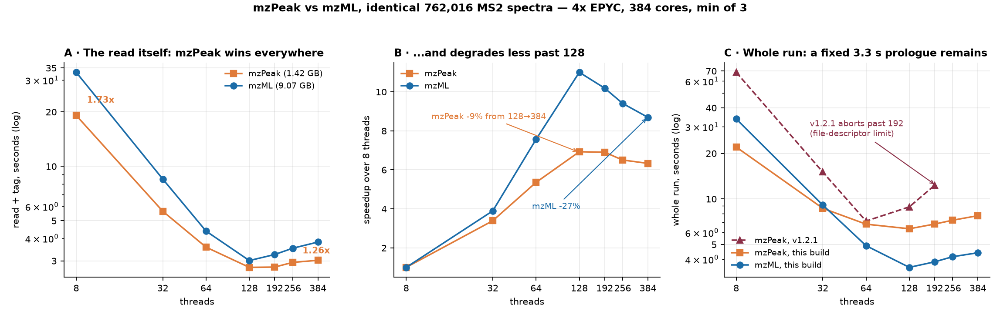

# Why reading mzPeak was slower than mzML, and what it took to reverse it

**Conclusion first: mzPeak now reads FASTER than mzML at every thread count
tested, and scales better.** The premise this investigation started from --
"reading the 1.42 GB columnar archive is slower than reading the 9.07 GB XML
file, that can't be true" -- was true when it was posed, and is no longer.

Everything below is measured. Where something is inferred, it says so.

## The measurement

Identical spectra in both containers: 762,016 MS2, 379,815,617 points, written
from one source run. mzPeak 1.42 GB, mzML 9.07 GB. Host `kim`, 4x AMD EPYC,
384 logical cores, load below 0.05/core at the start of each sweep. FASTag
reads one spectrum at a time, one reader object per thread, OpenMP
`schedule(guided,64)`. Min of three runs.

**The read itself** -- the OpenMP region, which is read plus tag and nothing
else:

| threads | mzPeak | mzML | mzPeak faster by |
|---|---|---|---|
| 8 | 19.12 s | 33.11 s | 1.73x |
| 32 | 5.64 s | 8.50 s | 1.51x |
| 64 | 3.57 s | 4.38 s | 1.23x |
| 128 | **2.76 s** | 3.01 s | 1.09x |
| 192 | 2.77 s | 3.25 s | 1.17x |
| 256 | 2.94 s | 3.52 s | 1.20x |
| 384 | 3.02 s | 3.81 s | 1.26x |

From 128 to 384 threads mzPeak degrades 9% and mzML 27%, so the anti-scaling
that started this has not merely gone: it has changed sides.

**The whole run**, same sweep, against the shipped v1.2.1 for scale:

| threads | v1.2.1 mzPeak | this build, mzPeak | this build, mzML |
|---|---|---|---|
| 8 | 68.63 s | **22.01 s** | 33.76 s |
| 32 | 15.05 s | **8.67 s** | 9.11 s |
| 64 | 7.14 s | 6.81 s | 4.91 s |
| 128 | 8.86 s | 6.35 s | 3.53 s |
| 192 | 12.30 s | 6.82 s | 3.84 s |
| 256 | **aborted** | 7.23 s | 4.15 s |
| 384 | **aborted** | 7.75 s | 4.41 s |

mzPeak is 3.1x faster than v1.2.1 at 8 threads and 1.8x at 192, and now runs
at thread counts where v1.2.1 could not run at all.

## Why the whole run still trails mzML above 32 threads

The read is won; the run is not. At 128 threads the phases account for the
difference exactly:

| phase | mzPeak | mzML | penalty |
|---|---|---|---|
| metadata map | 1.71 s | 0 | **+1.71** |
| rest of pre-loop | 0.18 s | 0.12 s | +0.06 |
| reader construction | 0.24 s | 0.01 s | +0.23 |
| **read + tag** | **2.92 s** | 2.99 s | **-0.07** |
| write | 0.31 s | 0.34 s | -0.03 |
| teardown | 1.48 s | 0.13 s | +1.35 |
| **wall** | **6.84 s** | **3.59 s** | +3.25 |
| peak RSS | 7.85 GB | 0.13 GB | |

Three fixed costs OUTSIDE the read loop, not the read: a whole-run metadata
map, per-thread reader construction, and tearing down an 8 GB working set.
mzML pays none of them because its reader seeks to a byte offset and holds
almost nothing.

## Correctness, verified on the benchmark archive

The measured binary is the committed source -- the sources on the benchmark
host checksum-match the repository -- and:

| check | result |
|---|---|
| this build vs shipped v1.2.1, mzPeak, 64 threads | **byte-identical** |
| this build, 8 threads vs 384 threads | **byte-identical** |
| mzPeak vs mzML, same spectra | 83 differing lines of 19,498,432 (4.3e-6) |

The third is PRE-EXISTING and not a product of this work: since the build is
byte-identical to v1.2.1 on the same container, the container-to-container
difference is unchanged by any of it. It is the f32 intensity storage breaking
peak-ranking ties, which is the deliberate trade that makes the archive 6.4x
smaller.

## The blockers, in the order they mattered

### 1. The planner re-planned the entire file for every spectrum

`Planner::plan()` evaluated the column statistics of ALL 363 row groups for
EVERY spectrum: **276,635,040 evaluations**, each a query callback, a
statistics `shared_ptr` copy, a type dispatch and a variant round-trip.
Measured at **599 of ~870 thread-seconds** of the read phase -- two thirds of
it.

For an equality on a column the file declares sorted in every row group, the
matching groups are contiguous, so the scan can stop at the first non-match
after a match, starting from the last group that matched through this reader.
The common case becomes one evaluation, because ~2,100 consecutive spectra
share a group.

Contiguous is not unique: 64 of the 762,016 spectra straddle a group boundary
and legitimately produce two ranges, so stopping at the FIRST match would
silently drop points.

**599 -> 95 thread-seconds (-84%).** Parallel phase 6.11 -> 4.98 s at 64
threads.

### 2. The executor walked and sliced ten batches to find one

The page index narrows a single-spectrum query to **582,880 rows, 56% of a row
group**, because the key column is so compressible that its page index has
almost no resolution (see `HANDOFF-page-index-resolution.md`). The executor
then sliced every batch in that range before filtering: **9.67 slices per
spectrum**.

Two changes: filter the UNSLICED batch and slice only the run that matched
(9.67 -> 1.008 slices), then pick the batch arithmetically from per-batch key
spans cached at decode time (**batches visited 9.67 -> 1.008 per spectrum**).

This is the change that addressed the anti-scaling, and the mechanism is worth
stating because it is invisible to profiling by data locality: Arrow's
`RecordBatch::column()` and `StructArray::field()` are not free once the child
is boxed. libstdc++ implements the atomic `shared_ptr` load they use with a
pool of **sixteen process-wide mutexes**. Every visited batch therefore
contended with every other thread's visits regardless of which row group each
thread was reading -- contention that grows with thread count and does not
care about locality. 7.4 million visits became 0.77 million.

### 3. Obtaining the page index cost more than using it

Once the group scan was fixed, planning was dominated by the Planner
CONSTRUCTOR -- 79 of the remaining 95 thread-seconds -- which is
`GetPageIndexReader()`. Since the executor now narrows inside the group by
itself, the page index is not needed for these queries at all. It is obtained
lazily and skipped entirely when a query resolves to whole row groups.

Caching one reader for the life of the file was tried first and is **48%
slower** (parallel 4.98 -> 7.36 s at 64 threads): a long-lived reader
accumulates the parsed index of every group it has touched.

### 4. A metadata column was resolved once per row instead of once per file

`resolve_field()` ran per ROW per FIELD while building the metadata map. Each
call built a `std::string` from a literal (24-char names are past SSO, so a
malloc and free every time), hashed it into the struct type, and copied a
`shared_ptr`. Roughly 15 million lookups.

**Metadata map 3.65 -> 1.80 s.** Confirmed by varying the number of uncached
lookups per call rather than assuming: 1x 3.66 s, 2x 5.93 s, 4x 10.03 s,
cached 1.80 s -- linear at ~2.2 s per pass.

### 5. Descriptors, not algorithms, capped the thread count

An mzPeak reader opens its own handles -- the signal member plus the metadata
facets, about six per thread -- so the usual soft limit of 1024 capped a run at
roughly 170 threads. Past it the archive failed with "Too many open files",
surfacing as an unrelated-looking OpenMS exception about a missing '.' in a
string. v1.2.1 aborts at 256 and 384 threads for this reason.

FASTag now raises its own soft limit toward the hard one (1024 against
1,048,576 here), which needs no privileges.

## What is left, and what it is worth

**The metadata map, 1.71 s.** Built once per archive, single-threaded, while
383 cores idle. It materialises descriptive metadata for all 762,016 spectra
before a peak is read -- the same shape of serial pre-pass that
`IndexedMzMLReader` exists to avoid on the mzML side, where the equivalent
fields are scraped per spectrum in parallel from bytes already being decoded.
Parallelising its first pass across row-group chunks is the obvious fix and is
not attempted here.

**Teardown, 1.48 s.** Freeing a 7.85 GB working set. Bounded by whatever the
row-group cache budget is set to; the budget is a real ceiling now that its
accounting is in decoded bytes.

**Reader construction, 0.24 s.** ~3.8 ms per reader, serialized on a
process-global mutex in the adapter, times the thread count.

Together these are the whole remaining gap. None of them is the read.

## Two things that are NOT the explanation

Both were plausible, both were measured, both were wrong:

- **The shared row-group cache's mutex.** Over 99% of spectra never reach the
  cache. A memo removing that traffic changed nothing -- and later turned out
  to be a data race, since it read two fields unsynchronised on a reader the
  library documents as shareable. Removed.
- **Cache thrashing, the allocator, and Arrow's IO thread pool.** Budget swept
  256 MB to 16 GB with no change once admission stopped blocking;
  `MALLOC_ARENA_MAX=2` recovers 9-22% RSS and costs 6x wall; `ARROW_IO_THREADS`
  in {8,32,128,256} changes nothing.

NUMA is a real but secondary contributor: pinning to one socket is 8-17%
faster at every thread count (9.62 vs 10.48 s at 32 threads, 8.20 vs 9.84 at
56), and pinned runs still stop improving past one socket's physical cores.

## Methodology, because three results here were nearly reported wrong

- **A shared machine invalidates timings silently.** Runs taken while other
  users pushed load average past 60 showed mzPeak *losing* to mzML; the same
  binaries on an idle host showed it winning at every thread count. mzPeak's
  8 GB working set is far more load-sensitive than mzML's 130 MB, so load does
  not scale the two equally. Every number above is min-of-three on a host
  checked for load before and after.
- **An instrument that fires 276 million times measures itself.** A global
  atomic counter in the planner loop made a statistics evaluation look like
  3.0 us. Counts and timings must not come from the same build.
- **Byte-identical output at low thread count proves very little.** The fast
  paths added here run only when a file declares a sorting column, so an
  archive without one exercised none of them while reporting success. One
  version of the executor change was byte-identical at 1 and 16 threads and
  passed all 38 library tests, then segfaulted in 2 of 3 runs at 192 threads.
  The library's own `one_shared_reader_across_threads_agrees` caught a second
  defect that no amount of single-threaded checking would have.

## Reviewer disagreement worth recording

Two models reviewed this independently and split on one point. Kimi held that
pre-boxing the Arrow children at decode time "covers all lazy initialisation --
nothing left there". Codex held that pre-boxing avoids *constructing* the box
but `StructArray::field()` still performs an atomic `shared_ptr` load on every
access, which libstdc++ backs with a 16-mutex pool. **Codex was right**, and
acting on it is what produced the change in section 2.

Kimi's unique contributions were the NUMA experiment and the sanity check that
both runs do the same work (`nPicked == 0`, confirmed).
